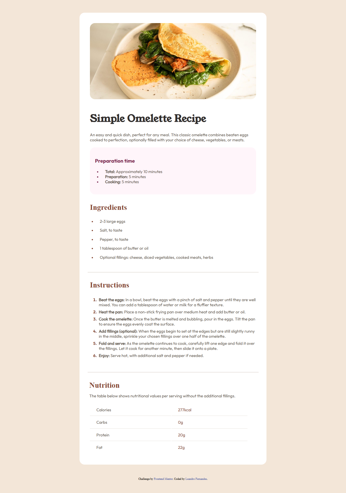

# 🍳 Recipe Card - Simple Omelette  

Um projeto prático desenvolvido com **HTML e CSS** para treinar minhas habilidades de estruturação e estilização de páginas.  
O desafio foi criar um **cartão de receita de um omelete**, organizado, responsivo e visualmente agradável, inspirado em um layout do [Frontend Mentor](https://www.frontendmentor.io/).  

---

## 🎯 Objetivo  

Colocar em prática conceitos fundamentais de **HTML semântico** e **CSS moderno**, com foco em:  

- Estruturação clara de conteúdo.  
- Uso de listas ordenadas e tabelas para exibir informações de forma acessível.  
- Estilização com cores, espaçamento e tipografia personalizada.  
- Aplicação de boas práticas de organização de código.  

---

## 🖼️ Prévia do Projeto  



---

## ⚙️ Tecnologias Utilizadas  

- **HTML5** → Estrutura semântica da página.  
- **CSS3** → Estilização com tipografia customizada e layout responsivo.  
- **Google Fonts (local)** → Fonte *Young Serif* e variações da *Outfit*.  

---

## 🚀 Como Executar o Projeto  

1. Clone este repositório:  
   ```bash
   git clone https://github.com/leandrofn3/recipe-page-main

2. Acesse a pasta do projeto:
   ```bash
   cd recipe-page-main

3. Abra o arquivo index.html em qualquer navegador.

## 💡 Aprendizados  

Durante o desenvolvimento, pratiquei:  

- A importância do **HTML semântico** para acessibilidade e SEO.  
- Como usar listas (`ul`, `ol`) e tabelas de forma clara e organizada.  
- Aplicação de **tipografia personalizada** com `@font-face`.  
- Organização de layout com espaçamento consistente e paleta de cores suave.  

---

## 📌 Créditos  

- Desafio proposto por [Frontend Mentor](https://www.frontendmentor.io?ref=challenge).  
- Desenvolvido por [Leandro Fernandes](https://www.linkedin.com/in/leandro-fernandes-nascimento/).  
